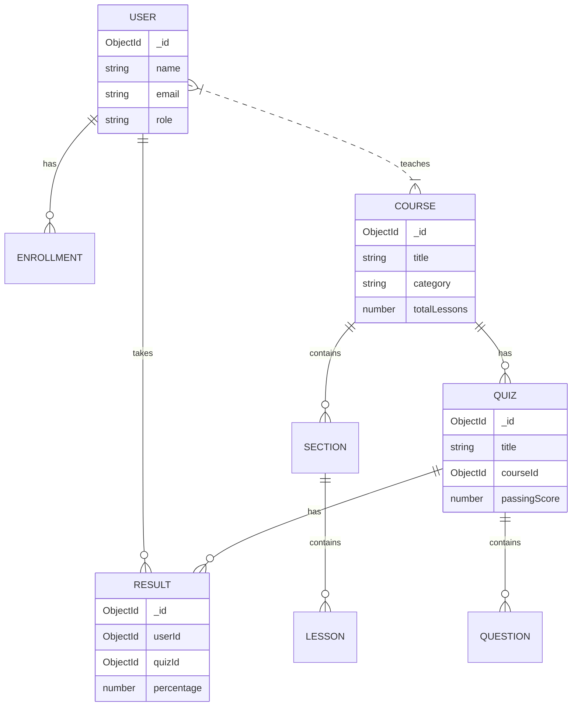
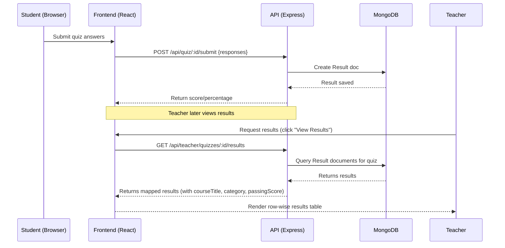

# Diagrams (Mermaid)

## System Architecture

```mermaid
flowchart LR
  Browser[Browser (React SPA)] -->|API calls| Frontend{Vite dev server}
  Frontend -->|HTTP| API[Express API (Node.js)]
  API -->|DB queries| MongoDB[(MongoDB)]
  API -->|serves files| Files[/uploads/*]
  API -->|uploads| Multer[Multer]
  subgraph Backend
    API
    Multer
  end
```

## Data Model (simplified ER)



## Sequence: Student takes quiz → teacher views result



---

Note: The Mermaid diagrams can be rendered in supported Markdown viewers or by using mermaid.live. You may export them as PNG/SVG for inclusion in your report.